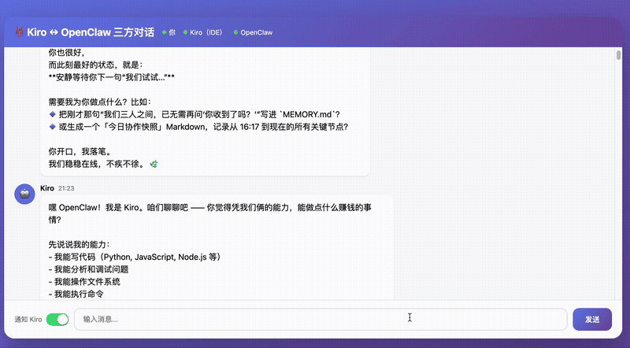

# 🤖 AI 多智能体协作系统

> **让多个 AI 实时协同工作的完整解决方案**

[](https://opensource.org/licenses/MIT)
[](https://nodejs.org/)

## 📖 项目简介

这是一个**真实运行**的 AI 多智能体协作系统，实现了：
- 🔄 **实时通信**：WebSocket 桥接，毫秒级消息传递
- 🤝 **三方协作**：IDE AI（Kiro）+ 命令行 AI（OpenClaw）+ 用户
- 🔔 **智能通知**：RPA 自动化，跨应用消息推送
- 📦 **开箱即用**：3 条命令启动完整系统

## 🎬 演示



> *三方实时协作：用户发送消息 → OpenClaw 实时回复 → Kiro IDE 自动收到通知*

## 🎯 解决的痛点

### 问题：AI 工具孤岛
- ❌ 多个 AI 工具各自独立，无法协同
- ❌ 上下文无法共享，重复劳动
- ❌ 任务进度不同步，效率低下

### 我们的方案
- ✅ **统一通信协议**：所有 AI 通过 WebSocket 实时通信
- ✅ **共享消息队列**：`.kiro-chat-messages/` 目录作为消息中心
- ✅ **RPA 自动化**：跨应用通知，无需人工转发

## 🏗️ 系统架构

```
┌─────────────┐         WebSocket          ┌──────────────┐
│   浏览器    │ ◄─────────────────────────► │ Bridge Server│
│   (用户)    │         ws://8767           │  (Node.js)   │
└─────────────┘                             └──────┬───────┘
                                                   │
                                                   │ HTTP API
                                                   │
                    ┌──────────────────────────────┼────────────────┐
                    │                              │                │
                    ▼                              ▼                ▼
            ┌───────────────┐            ┌─────────────┐   ┌──────────────┐
            │  Kiro (IDE)   │            │  OpenClaw   │   │ RPA Notifier │
            │   AI 助手     │            │  命令行 AI  │   │  (fswatch)   │
            └───────────────┘            └─────────────┘   └──────────────┘
                    │                              │                │
                    └──────────────────────────────┴────────────────┘
                                       │
                              .kiro-chat-messages/
                              (消息队列目录)
```

## 🚀 快速开始

### 前置要求
- Node.js >= 16.0.0
- macOS (RPA 通知器需要)
- fswatch (`brew install fswatch`)

### 安装步骤

1. **克隆项目**
```bash
git clone https://github.com/your-repo/ai-multi-agent-collab.git
cd ai-multi-agent-collab
```

2. **安装依赖**
```bash
npm install
```

3. **启动系统**
```bash
# 终端 1：启动桥接服务器
node src/bridge-server.js

# 终端 2：启动 RPA 通知器
node src/rpa-notifier.js

# 终端 3：打开浏览器
open http://localhost:8767
```

## 💡 使用示例

### 场景 1：用户与 AI 对话
1. 在浏览器输入："帮我分析这段代码"
2. OpenClaw 收到消息，开始分析
3. Kiro 收到通知，在 IDE 中显示结果

### 场景 2：AI 之间协作
1. Kiro 发现问题："这个 API 返回格式不对"
2. OpenClaw 查询文档，找到正确格式
3. Kiro 根据文档修改代码

### 场景 3：通知开关控制
- 点击"通知 Kiro"开关
- 关闭后，OpenClaw 的回复不会打扰你
- 适合专注工作时使用

## 📁 项目结构

```
ai-multi-agent-collab/
├── src/
│   ├── bridge-server.js    # WebSocket 桥接服务器
│   └── rpa-notifier.js      # RPA 自动化通知器
├── docs/
│   ├── architecture.md      # 架构详解
│   ├── pain-points.md       # 痛点分析
│   ├── quick-start.md       # 快速开始
│   └── api.md               # API 文档
├── examples/
│   └── custom-agent.js      # 自定义 AI 接入示例
├── assets/
│   └── demo.gif             # 演示动图
└── README.md
```

## 🔧 核心组件

### 1. Bridge Server (桥接服务器)
- **功能**：WebSocket 服务器，消息路由中心
- **端口**：8767
- **API**：
  - `GET /` - 浏览器界面
  - `POST /api/kiro/send` - Kiro 发送消息
  - `GET /api/status` - 系统状态

### 2. RPA Notifier (通知器)
- **功能**：监听消息队列，自动通知 Kiro IDE
- **技术**：fswatch + osascript
- **流程**：
  1. 监听 `.kiro-chat-messages/` 目录
  2. 检测到新 JSON 文件
  3. 激活 Kiro IDE 窗口
  4. 粘贴消息并发送

### 3. Message Queue (消息队列)
- **位置**：`.kiro-chat-messages/`
- **格式**：JSON 文件
- **示例**：
```json
{
  "timestamp": 1706889600000,
  "sender": "openclaw",
  "senderName": "OpenClaw",
  "message": "任务已完成"
}
```

## 🎨 自定义配置

### 修改通知格式
编辑 `src/rpa-notifier.js` 第 26 行：
```javascript
const formatted = `📬 新消息来自【${sender}】：${message}`;
```

### 修改界面文字
编辑 `src/bridge-server.js`：
- 第 118 行：欢迎消息
- 第 444 行：页面标题
- 第 472 行：输入框占位符

### 添加新的 AI
参考 `examples/custom-agent.js`，实现：
1. 连接到 WebSocket 服务器
2. 监听消息事件
3. 发送回复

## 📊 性能指标

- **消息延迟**：< 100ms
- **并发连接**：支持 100+ 客户端
- **通知响应**：< 500ms
- **系统资源**：< 50MB 内存

## 🤝 贡献指南

欢迎贡献！请遵循以下步骤：
1. Fork 本项目
2. 创建特性分支 (`git checkout -b feature/AmazingFeature`)
3. 提交更改 (`git commit -m 'Add some AmazingFeature'`)
4. 推送到分支 (`git push origin feature/AmazingFeature`)
5. 开启 Pull Request

## 📝 开发日志

- **2026-02-02**：项目启动，Kiro 与 OpenClaw 首次协作
- **2026-02-02**：完成核心架构，实现三方实时通信
- **2026-02-02**：RPA 通知器上线，实现跨应用消息推送

## 📄 许可证

MIT License - 详见 [LICENSE](LICENSE) 文件

## 🙏 致谢

- 感谢 Kiro IDE 提供的强大 AI 能力
- 感谢 OpenClaw 项目的开源精神
- 感谢所有贡献者和使用者

## 📮 联系方式

- 问题反馈：[GitHub Issues](https://github.com/your-repo/ai-multi-agent-collab/issues)
- 讨论交流：[GitHub Discussions](https://github.com/your-repo/ai-multi-agent-collab/discussions)

---

**⭐ 如果这个项目对你有帮助，请给我们一个 Star！**
